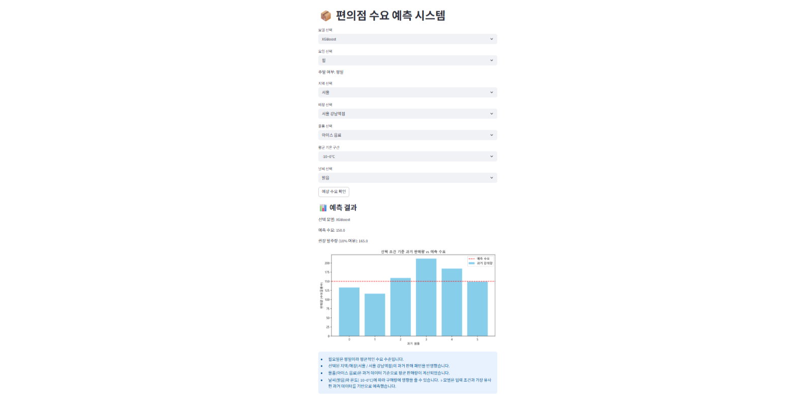

## 💫 MachineLearning Team Project
#### 빅데이터 활용 분석 모델 개발 프로젝트
B2B 고객 제품 수요량 예측 기반 재고 최적화

 

## 🕒 개발 시간
2025/11/03 ~ 2025/12/03

 

## 👥 같이 개발한 팀원 및 역할

본 프로젝트는 4명의 팀원이 동일한 역할을 분담하며 협업하는 방식으로 진행되었습니다.  
각 팀원은 아래의 개별 역할 및 공통 역할을 모두 수행했습니다.  

### 🧑‍🤝‍🧑 팀 구성 및 역할
- 김요원(팀장) : 데이터 기획, XGBoost 모델 학습, 문서 작업
- 김금 : 데이터 설계 및 수집, 데이터 분석
- 정연덕 : 데이터 전처리, Random Forest 모델 학습
- 최성민 : 데이터 전처리, LightGBM 모델 학습, 문서 작업

 

### 🤝 공통역할

- **데이터 전처리 및 Feature Engineering** 
(요일/주말 여부 생성, 온도 구간화, 범주형 인코딩 등) 

- **모델 개발 및 성능 비교**
  - XGBoost
  - LightGBM
  - Random Forest
  - Linear Regression

- **모델 학습/튜닝/평가 수행** 
(검증 데이터 분리, 하이퍼파라미터 조정, RMSE 기반 성능 평가) 

- **Streamlit 백엔드 개발**
  - 입력값 처리 및 인코딩
  - 모델 호출 및 예측 로직
  - Safe Transform 적용

- **예측 결과 시각화 구현** 
(과거 데이터 비교 그래프, 예측 사유 생성 등) 

- **UI 구성 및 기능 개발** 
(지역/매장/날씨 선택 기능, 필터링 UI, 결과 출력 인터페이스) 

## 📦 프로젝트 소개
본 프로젝트는 국내 5개 지역(서울, 경기도, 부산, 광주, 옥천)의 각 10개 매장, 총 50개 편의점 매장의 일별 상품 수요를 예측하기 위한 머신러닝 모델을 개발하는 것을 목표로 하였습니다. 지역, 요일, 주말 여부, 기온, 날씨 등의 다양한 변수를 활용해 미래 수요를 예측하고, 이를 바탕으로 재고 관리 최적화, 발주 자동화, 폐기 감소 등 실제 매장 운영 효율을 향상시키는 시스템을 구현하고자 하였습니다.
 

사용자는 요일, 지역, 매장, 상품, 기온, 날씨 등을 선택하면 모델이 해당 조건에서의 **예상 판매량과 권장 발주량(안전재고 포함)** 을 제시합니다.
 

또한 본 시스템은 XGBoost, LightGBM, Random Forest, Linear Regression 등 다양한 모델을 선택하여 예측 성능을 비교할 수 있도록 설계되어 있습니다.
이를 통해 특정 매장·품목 조합에 가장 적합한 모델을 찾고 데이터 기반 의사결정을 강화할 수 있습니다.

## 🎯 기획 의도

편의점의 발주 업무는 다음과 같은 문제가 존재합니다：
 

직원 또는 점주의 **경험에 의존한 발주 방식**
 

날씨·기온 등 외부 요인이 **판매량에 크게 영향을 미치지만 반영하기 어려움**
 

과발주로 인한 **재고 증가 / 폐기 비용 증가**
 

과소발주로 인한 **품절 및 매출 손실**
 

이 프로젝트는 이러한 문제를 해결하고자 다음 목표로 기획되었습니다.

 

## 🛠️ 개발환경
<b>→ Frontend</b>: 없음 (Streamlit 기반 자동 UI 생성)  
<b>→ Backend/Model</b>: Python, XGBoost, LightGBM, RandomForest, Linear Regression  
<b>→ Web UI Framework</b>: Streamlit  
<b>→ Tools</b>: Git, GitHub

 

## 📚 목차

01. 📌 [주요기능](#-주요기능)
02. 🖥️ [화면구성](#-화면구성)
03. ✨ [느낀 점](#-느낀-점)
04. 📑 [참고](#️-참고)

 

## 📌 주요기능
#### 🔍 1. 여러 머신러닝 모델 기반 수요 예측

사용자가 원하는 모델을 직접 선택해서 예측할 수 있음.

- XGBoost

- LightGBM

- Random Forest

- Linear Regression

모델 간 성능 비교 또는 상황별 모델 선택이 가능하도록 설계됨.

#### 🧭 2. 직관적인 UI 기반 입력 기능

Streamlit UI로 실제 편의점 환경과 유사한 입력 항목을 제공함.

- 요일 선택 → 주말 여부 자동 계산

- 지역 선택 → 선택한 지역의 매장만 자동 필터링

- 물품 선택

- 온도 선택 → 자동으로 평균 온도로 변환

- 날씨 선택

사용자가 실제 상황처럼 조건을 선택하면 되도록 구성됨.

#### 📈 3. 과거 데이터 기반 비교 분석 기능

예측 결과만 보여주는 것이 아니라,

- 동일 조건(요일, 지역, 매장, 물품, 온도, 날씨)의 과거 기록을 필터링하여,

- 막대 그래프 형태로 비교 시각화 제공

그래프로 제공되는 내용:

- 과거 실제 판매량(수요)

- 예측 수요(붉은 점선)

사용자는 예측 결과가 얼마나 현실적인지 한눈에 확인 가능함.

 

## 🖥️ 화면구성

본 프로젝트는 Streamlit 기반의 **단일 페이지(Single Page Application)** 구조로,
모든 기능(입력 UI, 모델 선택, 예측, 시각화)이 하나의 메인 화면에서 제공됩니다.

메인페이지

 

 

## ✨ 느낀 점
- 김요원: 편의점 수요예측 프로젝트를 통해, 데이터 품질과 전처리가 머신러닝 모델 성능에 결정적임을 깨달았고, 데이터를 기반으로 모델을 학습하고 최적화하는 경험을 쌓았습니다. 더 다양한 데이터와 세부 요인을 활용하지 못한 아쉬움은 있지만, 이번 경험이 실무에서 데이터를 다루고 머신러닝을 활용하는 데 큰 도움이 될 것이라 느꼈습니다.
- 김금: 이번 머신러닝 수요예측 프로젝트를 진행하면서 단순히 모델을 만드는 것뿐 아니라, 데이터 정제·전처리·피처 설계·모델 비교·시각화 같은 전체 파이프라인을 처음부터 끝까지 경험해볼 수 있었다. 특히 실제 편의점 데이터를 기반으로 수요를 예측한다는 점에서 “이런 게 바로 현업에서 쓰이는 흐름이구나”라는 감각을 많이 얻었고, 시행착오를 거치면서 ML 모델 간 성능 차이나 하이퍼파라미터의 중요성도 체감했다. 코드 구조나 실험 관리 측면에서는 아직 개선할 여지가 많지만, 이번 프로젝트를 통해 확실히 자신감이 붙었고 앞으로 더 복잡한 데이터나 다양한 모델에도 도전할 수 있겠다는 느낌을 받았다.
- 정연덕: 이번 프로젝트를 통해 복잡한 물류관리와 같은 데이터를 수월하게 관리할수 있게끔 할수있는 프로젝트 였습니다.
- 최성민: 실제 서비스처럼 지역–매장–물품–날씨–온도 등 다양한 변수를 사용자가 직접 선택하고 즉시 예측 결과를 받을 수 있게 구현하면서, 단순한 모델 성능보다 사용자가 쉽게 사용하고 신뢰할 수 있는 시스템 설계가 더 중요하다는 점을 느꼈습니다.

 

## 📑 참고
- 참고 문서: [기획 참고](https://blog.naver.com/red0808/224055137024)